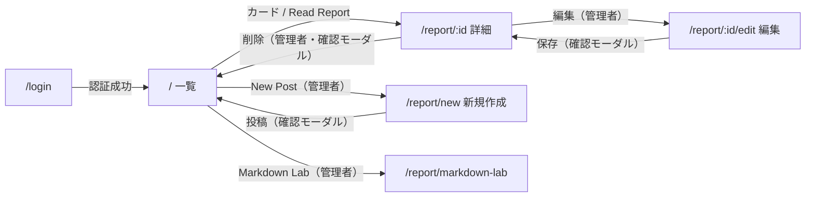

# 最新UIレイアウト要求（base準拠）

※ `docs/01-business-requirements.md`（旧 pre-requirements）は読み取り専用。以降の要求反映は本書に追記/更新する。

## 目次

- [概要](#概要)
- [グローバルレイアウト](#グローバルレイアウト)
- [画面: 一覧（/）](#画面-一覧)
- [画面: 詳細（/report/:id）](#画面-詳細reportid)
- [画面: 新規作成・編集（/report/new, /report/:id/edit）](#画面-新規作成編集reportnew-reportidedit)
- [画面: Markdown Style Lab（/report/markdown-lab）](#画面-markdown-style-labreportmarkdown-lab)
- [画面: ログイン（/login）](#画面-ログインlogin)
- [UIトーン/スタイル](#uiトーンスタイル)
- [データ/状態（現行の挙動）](#データ状態現行の挙動)
- [ルーティング](#ルーティング)
- [画面遷移図](#画面遷移図)
- [差分（01-business-requirements.md → 最新UI）](#差分01-business-requirementsmd--最新ui)
- [外部URL管理機能（機能仕様）](#外部url管理機能機能仕様)
  - [機能要件](#機能要件)
  - [アクセス制御](#アクセス制御)
  - [画面仕様](#画面仕様)

## 概要
- `base/` の画面実装が最新のレイアウト定義。
- 対象は「Markdownレポート閲覧・管理UI」。
- 画面は一覧 / 詳細 / 新規作成 / 編集 / ログイン / Markdown Style Lab で構成される。

## グローバルレイアウト
- ヘッダー＋サイドバー＋メイン＋フッターの2カラム構成。
- ヘッダーは固定表示（sticky）で、未ログイン時はログインボタン、ログイン時は「New Post」「Markdown Lab」とユーザー情報＋Logoutを表示。
- サイドバーはPC表示のみ（`md`以上）でカテゴリとタグ一覧、Director's Manifestoを表示。
  - カテゴリは固定リスト（Development / AI / Cloud / Linux / Container / Application / Program / Hobby）。
  - サイドバーは固定幅（`w-64` 相当）を持ち、タグが幅内で折り返して表示される。（Issue #60）
- ログイン画面のみ、ヘッダー/サイドバー/フッターを非表示で全画面センタリング。

## 画面: 一覧（/）
- 画面上部にタイトル「Latest Reports」を表示（説明文は無し）。
- レポートは2カラムカード（`lg`以上）で表示。
  - カテゴリバッジ、日付、タイトル、要約、著者名を含む。
  - 「Read Report →」リンクで詳細へ遷移。
- 一覧のレポート表示は1ページ10件。
- ページャーは「前へ」「次へ」とページ番号を表示し、ページ番号ボタンは最大5個まで表示する。
- フィルタ適用中は、現在のカテゴリ/タグとクリアボタンを表示する。
- レポートが0件の場合は「No reports found.」を中央表示。
- サイドバーのカテゴリ/タグをクリックすると一覧をフィルター（再クリックで解除）。
- 一覧へ戻るとカテゴリ/タグフィルターはリセットされる。

## 画面: 詳細（/report/:id）
- パンくず的な「All Reports」リンクとカテゴリバッジを表示。
- タイトル、著者名、日付を表示。
- ログイン時のみ「編集」「削除」アクションを表示。
- 本文はMarkdownをサニタイズして表示（見出し/リスト/改行など）。
- 外部URLが1件以上ある場合、タグの上に「External Links」セクションを表示（0件時は非表示）。（詳細: 本書「外部URL管理機能（機能仕様）」セクション）
- タグはフッター領域でチップ表示。
- 削除は確認モーダルを挟む。

## 画面: 新規作成・編集（/report/new, /report/:id/edit）
- フォーム項目
  - タイトル、カテゴリー、タグ（カンマ区切り）、要約、本文（Markdown）
  - 外部URL（0件〜N件、URL + ラベルのペア、動的追加/削除）（詳細: 本書「外部URL管理機能（機能仕様）」セクション）
- 送信前に確認モーダルを表示。
- 未ログイン時はログイン画面へリダイレクト。

## 画面: Markdown Style Lab（/report/markdown-lab）
- Markdown表示デザインの調整用検証画面（Pattern 07を基準）。
- 表示内容は詳細画面のMarkdown描画と同じスタイルを利用する。
- 未ログイン時はログイン画面へリダイレクト（認証後のみアクセス可）。

## 画面: ログイン（/login）
- ローカル認証時はメール/パスワード入力、Authenticateボタン。
- OAuth時はGoogleログインボタンのみ。
- 管理者メールは環境変数（`ADMIN_EMAIL`）の一致のみ許可。
- 失敗時はエラーメッセージを表示。
- 文言は日本語中心、コンポーネントはカード中央配置。

## UIトーン/スタイル
- 深いブラウン系のハイコントラストデザイン。
- 見出しは太字・大きめ、本文は落ち着いた書体。
- ボタンは太字・大文字・間隔広めのラベル。

## データ/状態（現行の挙動）
- E2E/ローカル動作時は `localStorage` を使用。
- 本番はSupabaseデータを表示し、初期ダミーデータは表示しない。

## ルーティング
- `/` 一覧
- `/report/:id` 詳細
- `/report/new` 新規作成
- `/report/:id/edit` 編集
- `/report/markdown-lab` Markdownデザイン検証（認証必須）
- `/login` ログイン
- `/docs` API リファレンス（Swagger UI・**管理者のみ**）。スペックは管理者ゲート付き `/api/openapi` から取得

## 画面遷移図

## 差分（01-business-requirements.md → 最新UI）
- アーキテクチャ想定（Next.js/TS/TailwindCSS/Supabase）に沿ってApp Routerで実装。
- レポート閲覧中心の要件は維持しつつ、ログイン/投稿/編集/削除までのUIをフロントで具現化。
- Markdown表示は `react-markdown` + `remark-gfm` + `rehype-sanitize` で安全に表示。
- 公開範囲/権限（public/auth/admin）は将来想定だが、現状はログイン有無のみで制御。
- 画面構成は一覧/詳細/投稿/編集/ログイン/Markdown Style Labの6画面に確定。

---

## 外部URL管理機能（機能仕様）

レポートに外部URL（note / Zenn / はてなブログ / 一般サイト等）を**複数**紐付けて保存・閲覧する機能。

### 機能要件

- **FR-1 URL登録（作成・編集フォーム）**: 1レポートに **0件〜N件**。各URLは「URL（必須）」+「ラベル（任意）」のペア。「+ URL追加」で入力行を動的に追加、各行に削除ボタン。URL 0件のまま投稿・更新可能。
- **FR-2 URL表示（詳細画面）**: 紐付くURLが**1件以上**ある場合のみ、タグセクションの上にリンク一覧を表示（0件時は非表示）。各リンクは `target="_blank"` / `rel="noopener noreferrer"`。ラベルがあればラベル、無ければURLをそのまま表示。
- **FR-3 URL削除（レポート削除連動）**: レポート削除時、紐付く全URLも CASCADE 削除。

### アクセス制御

| 操作 | 権限 |
|---|---|
| 閲覧 | 誰でも（未ログインでも表示） |
| 登録・更新・削除 | 認証ユーザーのみ |

### 画面仕様

- **詳細画面（/report/:id）**: タグチップ一覧の上に「External Links」セクション。箇条書きリスト形式、リンク末尾に外部リンクアイコン（↗）。0件時はセクション非表示。
- **フォーム画面（/report/new, /report/:id/edit）**: タグ入力フィールドの下に「External Links」セクション。各行 `[URL入力] [ラベル入力] [✕ 削除]`、末尾に `[+ URL追加]`。編集画面では既存URLを初期表示。

> データモデル（ExternalUrl テーブル）・バリデーション詳細は `docs/05-data-specification.md`、API 拡張は `docs/07-api-specification.md`、コンポーネント設計は `docs/09-architecture-specification.md` を参照。
