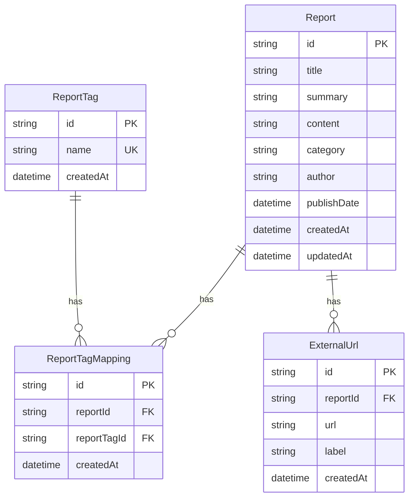

# データ仕様書

データモデル・DBスキーマ・RLS・バリデーションを定義する。命名規約・マイグレーション方針の正本は `.claude/rules/database.md`。

## 目次

- [ER図](#er図)
- [データ要件](#データ要件)
- [現行テーブル（schema.prisma）](#現行テーブルschemaprisma)
- [ExternalUrl テーブル（外部URL管理機能）](#externalurl-テーブル外部url管理機能)
  - [Prismaスキーマ（ExternalUrl）](#prismaスキーマexternalurl)
  - [DB作成手順](#db作成手順)
- [バリデーション](#バリデーション)
- [RLSポリシー（Supabase Row Level Security）](#rlsポリシーsupabase-row-level-security)

## ER図



## データ要件

- Report: `id`, `title`, `summary`, `content`, `category`, `author`, `publishDate`, `tags`
- ExternalUrl: `id`, `reportId` (FK → Report.id), `url`, `label`(nullable), `createdAt` — 1 Report : N ExternalUrl
- User: Supabase Auth を利用（アプリ側のUserテーブルは持たない）
- 必須項目: title / content / category / author / tags
- タグ入力はカンマ区切り → `#` 付き配列に正規化
- カテゴリは固定リスト（Development / AI / Cloud / Linux / Container / Application / Program / Hobby）
- サイドバーに表示するタグは `ReportTag` テーブルを参照し、一覧フィルタに使用する。
- Prismaは既存テーブルを `prisma db pull` で取得し、`schema.prisma` に反映（マイグレーションは行わない）。
- 環境変数: `DATABASE_URL`（Supabase Postgres 接続）。`prisma.config.ts` で参照し、`schema.prisma` には接続文字列を置かない。

## 現行テーブル（schema.prisma）

| テーブル | 主要フィールド |
|---|---|
| `Report` | id, title, summary, content, category, author, publishDate, createdAt, updatedAt |
| `ReportTag` | id, name(`@unique`), createdAt |
| `ReportTagMapping` | id, reportId, reportTagId, createdAt（`@@unique([reportId, reportTagId])`） |
| `ExternalUrl` | id, reportId, url, label(nullable), createdAt |

- テーブル名（モデル名）: PascalCase・単数形。カラム名: camelCase。`@@map` / `@map` は不使用。
- リレーション: `Report` 1—N `ReportTagMapping` N—1 `ReportTag`（多対多の中間）、`Report` 1—N `ExternalUrl`。

## ExternalUrl テーブル（外部URL管理機能）

| カラム | 型 | 制約 | 説明 |
|---|---|---|---|
| id | UUID | PK, DEFAULT uuid() | 一意識別子 |
| reportId | UUID | FK → Report.id, ON DELETE CASCADE, NOT NULL | 紐付け先レポート |
| url | TEXT | NOT NULL | 外部URL |
| label | TEXT | NULLABLE | 表示ラベル |
| createdAt | TIMESTAMPTZ | NOT NULL, DEFAULT NOW() | 登録日時 |

- インデックス: `ExternalUrl_reportId_idx` ON (`reportId`)
- Report 削除時は ExternalUrl も CASCADE 削除。

### Prismaスキーマ（ExternalUrl）

```prisma
model ExternalUrl {
  id        String   @id @default(uuid())
  reportId  String
  url       String
  label     String?
  createdAt DateTime @default(now())

  Report    Report   @relation(fields: [reportId], references: [id], onDelete: Cascade)

  @@index([reportId])
}
```

### DB作成手順

> DBマイグレーション禁止ルールに従い、テーブル作成は別プロジェクトで行う。

1. 別プロジェクトで `ExternalUrl` テーブル + RLS + インデックスを作成
2. `cd front && npx prisma db pull` で `schema.prisma` に反映
3. `npx prisma generate` でクライアント再生成

> **テスト用 DB（IT）**: 統合テストのコンテナには `pnpm gen:test-schema`（`prisma migrate diff --from-empty`。DB を変更しない読み取り専用 diff）で `schema.prisma` から DDL を生成し、使い捨てコンテナにのみ適用する。本番 DB・Supabase には適用しない（`.claude/rules/database.md` の test-only 例外を参照）。

## バリデーション

| 対象 | ルール |
|---|---|
| title | 必須、最大200文字 |
| content | 必須、最大50000文字 |
| category | 必須、固定リスト一致 |
| author | 必須 |
| tags | 1つ以上、各50文字以内、最大20個。canonical form は `#` 付き |
| summary | 任意、最大500文字 |
| externalUrls[].url | 必須、`http://`/`https://` で始まる（`/^https?:\/\//`） |
| externalUrls[].label | 任意、最大200文字 |

実装は `front/src/schemas/report.ts`（zod が正準）と、それを包む `front/src/lib/validation.ts`。
API での扱いは `docs/07-api-specification.md` を参照。

**category は DB 側に CHECK 制約が無く、担保はアプリ側の 2 点のみ**（Issue #190）:

1. **書き込み時** — Route Handler が `reportCategorySchema`（`z.enum(CATEGORIES)`）で検証する。
2. **読み出し時** — `front/src/lib/report.ts` の `parseReportList` / `parseReportItem` が、API レスポンスと
   localStorage の値を状態へ入れる前に検証する。固定リスト外の値を持つレポートは**その 1 件だけ捨て、
   `console.error` に残す**（1 件の混入で一覧全体が消えないようにするため）。

読み出し時の検証があることで、`ReportItem.category` を `ReportCategory` union として宣言できる
（型が実行時に裏付けられている状態）。

## RLSポリシー（Supabase Row Level Security）

全テーブルで RLS 有効。ポリシーは `auth.uid() IS NOT NULL` で認証判定。

| テーブル | SELECT | INSERT | UPDATE | DELETE |
|---|---|---|---|---|
| `Report` | 誰でも (`true`) | 認証ユーザー | 認証ユーザー | 認証ユーザー |
| `ReportTag` | 誰でも (`true`) | 認証ユーザー | — | — |
| `ReportTagMapping` | 誰でも (`true`) | 認証ユーザー | — | 認証ユーザー |
| `ExternalUrl` | 誰でも (`true`) | 認証ユーザー | 認証ユーザー | 認証ユーザー |

- SELECT は未ログインでも許可（公開閲覧）。INSERT/UPDATE/DELETE は Supabase Auth の認証セッションが必要。
- 管理者の細かい判定は RLS ではなくサーバーサイドAPI（`/api/auth/admin`）で実施（詳細: `docs/06-security-specification.md`）。
