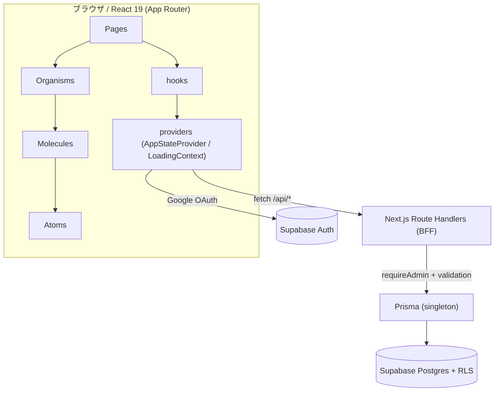

# アトミックデザイン設計書

## 目次

- [システム構成図](#システム構成図)
- [概要](#概要)
- [スコープ](#スコープ)
- [現状の構成](#現状の構成)
  - [Provider/Shell のスコープ（現状）](#providershell-のスコープ現状)
- [設計判断（レビュー指摘への回答）](#設計判断レビュー指摘への回答)
  - [フィルタ状態の所有者](#フィルタ状態の所有者)
  - [AppLink と LoadingProvider の境界](#applink-と-loadingprovider-の境界)
  - [theme（DesignSystem）の受け渡し](#themedesignsystemの受け渡し)
  - [AppStateProvider の肥大化](#appstateprovider-の肥大化)
  - [LoginPage のローディング重複](#loginpage-のローディング重複)
- [アトミックデザイン階層](#アトミックデザイン階層)
  - [Atoms（最小の再利用可能部品）](#atoms最小の再利用可能部品)
  - [Molecules（Atomの組み合わせ）](#moleculesatomの組み合わせ)
  - [Organisms（独立した複合セクション）](#organisms独立した複合セクション)
  - [Pages（ルートレベル、データ接続）](#pagesルートレベルデータ接続)
- [hooks（カスタムフック）](#hooksカスタムフック)
- [providers（状態管理）](#providers状態管理)
- [層間の依存方向ルール](#層間の依存方向ルール)
  - [AppLink の例外について](#applink-の例外について)
- [移行後のディレクトリ構造](#移行後のディレクトリ構造)
- [移行フェーズ](#移行フェーズ)
  - [Phase 1: ディレクトリ作成 + providers/hooks分離 + Atoms抽出](#phase-1-ディレクトリ作成--providershooks分離--atoms抽出)
  - [Phase 2: Molecules抽出](#phase-2-molecules抽出)
  - [Phase 3: Organisms再編成 + hooks抽出](#phase-3-organisms再編成--hooks抽出)
  - [Phase 4: Pages整理 + 最終クリーンアップ](#phase-4-pages整理--最終クリーンアップ)
- [設計方針](#設計方針)
  - [theme（DesignSystem）の受け渡し](#themedesignsystemの受け渡し-1)
  - [フィルタ状態の所有者](#フィルタ状態の所有者-1)
  - [hooks 設計方針](#hooks-設計方針)
  - [LoginForm のローディング責務](#loginform-のローディング責務)
  - [barrel export](#barrel-export)
  - [命名規則](#命名規則)
- [外部URL管理機能（コンポーネント設計）](#外部url管理機能コンポーネント設計)
  - [新規コンポーネント](#新規コンポーネント)
  - [既存コンポーネントの変更](#既存コンポーネントの変更)
  - [hooks 変更](#hooks-変更)
  - [ローカルモード対応（E2E）](#ローカルモード対応e2e)
  - [設計判断](#設計判断)
- [システム構成・技術スタック（概要）](#システム構成技術スタック概要)

## システム構成図



## 概要

`front/src/components/` のフラット構成をアトミックデザイン4階層（Atoms / Molecules / Organisms / Pages）に再編成する。
ロジックは `hooks/` に、状態管理は `providers/` に分離する。
段階的に移行し、各フェーズでE2Eテストの全パスを確認する。

## スコープ

**対象**: UI コンポーネントの階層整理、UIロジックの hooks 分離、Provider/Context の配置移動。

**対象外**: `AppStateProvider` の内部分割（認証/CRUD/タグ同期の責務分離）は本 Issue (#37) では行わない。
provider は現在の責務を維持したまま `providers/` ディレクトリに移動のみ行う。
domain/state の分割は別 Issue で扱う。

## 現状の構成

```text
front/src/components/
├── AppLink.tsx              # Link + ローディングトリガー
├── AppShell.tsx             # Header + Sidebar + Main + Footer レイアウト
├── AppStateProvider.tsx     # グローバル状態（認証/レポートCRUD）
├── ConfirmationModal.tsx    # 確認ダイアログ
├── Footer.tsx               # フッター
├── Header.tsx               # ヘッダー（ナビ + 認証）
├── LoadingContext.tsx        # ローディングContext
├── ReportMarkdown.tsx       # Markdown描画
├── Sidebar.tsx              # カテゴリ + タグ + マニフェスト
└── pages/
    ├── DetailPage.tsx       # 詳細画面
    ├── FormPage.tsx         # 投稿/編集画面
    ├── ListPage.tsx         # 一覧画面（ページング付き）
    ├── LoginPage.tsx        # ログイン画面
    └── MarkdownLabPage.tsx  # Markdown Style Lab
```

### Provider/Shell のスコープ（現状）

```text
layout.tsx
  └── AppStateProvider          ← 全ルート共通（認証/レポート/フィルタ状態）
        ├── AppShell             ← /, /report/*, /report/markdown-lab
        │     └── LoadingProvider  ← AppShell 内部のみ
        │           ├── Header
        │           ├── Sidebar
        │           ├── main > children
        │           └── Footer
        └── LoginPage            ← /login（AppShell 不使用・LoadingProvider スコープ外）
```

**課題:**

- Atom（AppLink）とOrganism（Header）が同一ディレクトリに混在
- ページコンポーネントが巨大（ListPage: 190行、FormPage: 200行）で内部にAtom/Molecule相当が埋め込み
- 再利用可能なUI部品（ボタン、バッジ、フォームフィールド）が各コンポーネントにインライン定義
- ロジック（ページング、フィルタ、フォーム処理）がコンポーネントに直接埋め込み
- Context/Providerが `components/` 直下に混在
- AppLink が `useLoading()` 必須だが、LoadingProvider は AppShell 内部のみ → Shell 外で使うと例外
- LoginPage が独自にローディングスピナーを実装しており、LoadingOverlay と重複

## 設計判断（レビュー指摘への回答）

### フィルタ状態の所有者

**決定: グローバル（AppStateProvider）を維持する。**

カテゴリ/タグの選択状態は `AppStateProvider` が保持し続ける。
理由: Sidebar（AppShell 配下）と ListPage の両方がこの状態を読み書きするため、page-local に移すと Sidebar への伝達経路がなくなる。

- `useReportFilter` は hooks に作成しない（フィルタ状態は provider 管轄）
- ListPage 内のフィルタリング計算（`visibleReports` の算出）は `usePagination` の入力として残す
- Sidebar は引き続き AppShell 経由で provider のフィルタ操作を受け取る

### AppLink と LoadingProvider の境界

**決定: `useLoading` を context-optional にする。**

`useLoading` を provider 非存在時に no-op を返すよう変更する。

```ts
// 変更前: provider 必須（例外送出）
export const useLoading = () => {
  const context = useContext(LoadingContext);
  if (!context) throw new Error('useLoading must be used within LoadingProvider');
  return context;
};

// 変更後: provider 非存在時は no-op
export const useLoading = () => {
  const context = useContext(LoadingContext);
  return context ?? { startLoading: () => {} };
};
```

これにより AppLink は真の atom になり、Shell 外（LoginPage 等）でも安全に使用できる。
LoadingProvider のスコープ（AppShell 内部）は変更しない。

### theme（DesignSystem）の受け渡し

**決定: Atoms は `theme` を受け取らない。Organisms 以上が `theme` → 個別 props に変換する。**

- **Atoms**: `variant`, `size`, `className` 等のセマンティックな props のみ受け取る。アプリ固有の `DesignSystem` 型に依存しない
- **Molecules**: 基本的に `theme` を受け取らない。Atoms に className/variant を渡す程度
- **Organisms 以上**: `theme` を受け取り、内部で Atoms/Molecules の props に変換する

```tsx
// Atom: theme 非依存
<Button variant="primary" className="px-8 py-2">投稿する</Button>
<Badge className="bg-[#5c4033] text-white">AI</Badge>

// Organism: theme → atom props への変換を担当
const Header: React.FC<{ theme: DesignSystem; ... }> = ({ theme }) => {
  return <Button variant="outline" className={`${theme.colors.border} ${theme.colors.text}`}>Login</Button>;
};
```

### AppStateProvider の肥大化

**決定: #37 のスコープ外。**

現行の AppStateProvider は認証・CRUD・タグ同期・cookie・router 遷移を一手に担っているが、
本 Issue は UI 再編成が主目的であり、provider の内部分割は行わない。
`providers/` ディレクトリへの移動のみ実施する。
domain/state の分割は別 Issue として起票する。

### LoginPage のローディング重複

**決定: LoadingOverlay organism に吸収する。**

LoginPage 内のインラインスピナー（`LoginPage.tsx:52-58`）を削除し、
`organisms/LoadingOverlay` を直接使用する。
`useLoading` の context-optional 化により、AppLink 同様 Shell 外でも安全に利用できる。

## アトミックデザイン階層

### Atoms（最小の再利用可能部品）

**原則: `DesignSystem` 型に依存しない。`variant` / `size` / `className` で制御する。**

| コンポーネント | 説明 | 抽出元 |
|---|---|---|
| `Button` | 汎用ボタン（variant: primary/danger/outline/ghost） | Header, FormPage, LoginPage, DetailPage |
| `Input` | テキスト入力フィールド | FormPage, LoginPage |
| `TextArea` | テキストエリア | FormPage |
| `Select` | ドロップダウン選択 | FormPage |
| `Badge` | カテゴリ/ステータスバッジ | ListPage, DetailPage |
| `TagChip` | タグチップ（#付き） | Sidebar, DetailPage |
| `AppLink` | ナビゲーションリンク（context-optional） | — |
| `Avatar` | 著者アバター円 | ListPage, DetailPage |
| `Spinner` | ローディングスピナー | AppShell, LoginPage |
| `SectionLabel` | セクション見出し（uppercase tracking） | Sidebar, FormPage |

### Molecules（Atomの組み合わせ）

| コンポーネント | 説明 | 構成Atom |
|---|---|---|
| `FormField` | ラベル + Input/TextArea/Select | SectionLabel + Input/TextArea/Select |
| `AuthorInfo` | アバター + 名前 + ロール | Avatar + テキスト |
| `FilterIndicator` | 現在のフィルタ表示 + クリアボタン | Badge + Button |
| `PaginationNav` | ページネーションバー | Button群 |
| `NavLink` | ヘッダーナビリンク | AppLink |
| `CategoryButton` | サイドバーカテゴリ項目 | Button |
| `ReportCardMeta` | バッジ + 日付 | Badge + テキスト |
| `UserAuthSection` | ユーザー情報 + Logoutボタン | Button + テキスト |
| `ExternalUrlInput` | 外部URL入力1行（URL + ラベル + 削除） | Input + Button（詳細: 本書「外部URL管理機能（コンポーネント設計）」セクション） |
| `ExternalUrlFieldList` | 外部URL入力行の繰り返し + 追加ボタン | SectionLabel + ExternalUrlInput |
| `ExternalUrlLinks` | 詳細画面の外部リンク一覧表示 | SectionLabel + リンク |

### Organisms（独立した複合セクション）

**原則: `theme: DesignSystem` を受け取り、内部の Atoms/Molecules に個別 props として変換する。**

| コンポーネント | 説明 | 構成 |
|---|---|---|
| `AppShell` | Header + Sidebar + Main + Footer レイアウト | Header + Sidebar + Footer + LoadingOverlay |
| `Header` | ロゴ + ナビ + 認証セクション | AppLink + NavLink + UserAuthSection |
| `Sidebar` | カテゴリ一覧 + タグ一覧 + マニフェスト（固定幅 `w-64`、タグは `flex-wrap` で折り返し） | SectionLabel + CategoryButton + TagChip |
| `Footer` | ブランド + コピーライト | テキスト |
| `LoginForm` | ログインフォーム（`useLoginForm` の `isSubmitting` に従い LoadingOverlay を内部表示） | FormField + Button + LoadingOverlay |
| `ConfirmationModal` | 確認モーダル | Button + テキスト |
| `ReportMarkdown` | Markdown描画 | 内部react-markdown |
| `LoadingOverlay` | 全画面ローディング（Shell内外で共用） | Spinner |

> **実装メモ:** 当初計画にあった `ReportCard` / `ReportForm` organisms は**抽出を見送り**、一覧カード/投稿フォームの markup はそれぞれ `pages/ListPage.tsx` / `pages/FormPage.tsx` 内に残している。`organisms/` には上記8ファイルのみが存在する。

### Pages（ルートレベル、データ接続）

| コンポーネント | 説明 |
|---|---|
| `ListPage` | 一覧（カード markup インライン + FilterIndicator + PaginationNav） |
| `DetailPage` | 詳細（ReportMarkdown + AuthorInfo + ExternalUrlLinks + ConfirmationModal） |
| `FormPage` | 投稿/編集（フォーム markup インライン + FormField + ExternalUrlFieldList） |
| `LoginPage` | ログイン（LoginForm）。LoadingOverlay は LoginForm 内部で管理 |
| `MarkdownLabPage` | Markdown検証（ReportMarkdown） |

## hooks（カスタムフック）

| フック | 説明 | 抽出元 |
|---|---|---|
| `useAppState` | グローバル状態へのアクセス（re-export） | AppStateProvider |
| `useLoading` | ローディングトリガー（context-optional） | LoadingContext |
| `usePagination` | ページネーションロジック（ページ計算/フィルタ連動リセット） | ListPage |
| `useReportForm` | フォーム状態管理 + バリデーション + 送信処理（externalUrls 管理含む） | FormPage |
| `useLoginForm` | ログインフォーム状態 + 送信処理 | LoginPage |
| `useReport` | 詳細レポートの個別取得（supabaseモードは `/api/reports/[id]`、localモードは listReport を返す） | DetailPage |

※ `useReportFilter` は作成しない。フィルタ状態は AppStateProvider の責務として維持する。

## providers（状態管理）

| ファイル | 説明 |
|---|---|
| `AppStateProvider.tsx` | グローバル状態管理（認証/レポートCRUD/テーマ/フィルタ）。内部分割は別 Issue |
| `LoadingContext.tsx` | ローディングContext。スコープは AppShell 内部のまま維持 |

## 層間の依存方向ルール

```text
許可される依存方向（上位 → 下位のみ）:

  Pages → Organisms → Molecules → Atoms
    ↓         ↓           ↓         ↓
  hooks ←←←←←←←←←←←←←←←←←←←←←←←←┘
    ↓
  providers ← layout.tsx（設置ポイントのみ直接 import 可）

禁止:
  - Atoms → Molecules, Organisms, Pages
  - Molecules → Organisms, Pages
  - Organisms → Pages
  - UI コンポーネント（atoms〜pages） → providers（直接 import 禁止、hooks 経由で統一）
  - Atoms → hooks（唯一の例外: AppLink の useLoading、no-op fallback で安全）
  - hooks → components（hooks はデータ/ロジックのみ、JSX を返さない）
```

| 層 | import 可能な対象 |
|---|---|
| **Atoms** | React, 外部ライブラリ, `hooks/useLoading`（AppLink のみ例外） |
| **Molecules** | Atoms, React, 外部ライブラリ |
| **Organisms** | Atoms, Molecules, React, 外部ライブラリ, hooks |
| **Pages** | Atoms, Molecules, Organisms, hooks |
| **hooks** | providers, `types/`, `constants/`, 外部ライブラリ（コンポーネント import 禁止） |
| **providers** | `types/`, `constants/`, `lib/`, 外部ライブラリ |
| **設置ポイント**（`layout.tsx` 等） | providers を直接 import して Provider ツリーを構築する唯一の場所 |

**UI コンポーネント（atoms〜pages）から providers を直接 import しない。**
グローバル状態やコンテキストへのアクセスは必ず `hooks/` 経由で行う。
providers を直接 import できるのは `layout.tsx` 等の Provider 設置ポイントのみ。

### AppLink の例外について

AppLink は atom だが `useLoading` に依存する。ただし `useLoading` は context-optional（no-op fallback）のため、
provider 非存在でも安全に動作する。この1件のみ「atom → hooks」の依存を許可する。

## 移行後のディレクトリ構造

```text
front/src/
├── components/
│   ├── atoms/
│   │   ├── index.ts
│   │   ├── Button.tsx
│   │   ├── Input.tsx
│   │   ├── TextArea.tsx
│   │   ├── Select.tsx
│   │   ├── Badge.tsx
│   │   ├── TagChip.tsx
│   │   ├── AppLink.tsx
│   │   ├── Avatar.tsx
│   │   ├── Spinner.tsx
│   │   └── SectionLabel.tsx
│   ├── molecules/
│   │   ├── index.ts
│   │   ├── FormField.tsx
│   │   ├── AuthorInfo.tsx
│   │   ├── FilterIndicator.tsx
│   │   ├── PaginationNav.tsx
│   │   ├── NavLink.tsx
│   │   ├── CategoryButton.tsx
│   │   ├── ReportCardMeta.tsx
│   │   ├── UserAuthSection.tsx
│   │   ├── ExternalUrlInput.tsx
│   │   ├── ExternalUrlFieldList.tsx
│   │   └── ExternalUrlLinks.tsx
│   ├── organisms/
│   │   ├── index.ts
│   │   ├── AppShell.tsx
│   │   ├── Header.tsx
│   │   ├── Sidebar.tsx
│   │   ├── Footer.tsx
│   │   ├── LoginForm.tsx
│   │   ├── ConfirmationModal.tsx
│   │   ├── ReportMarkdown.tsx
│   │   └── LoadingOverlay.tsx
│   └── pages/
│       ├── index.ts
│       ├── ListPage.tsx
│       ├── DetailPage.tsx
│       ├── FormPage.tsx
│       ├── LoginPage.tsx
│       └── MarkdownLabPage.tsx
├── hooks/
│   ├── index.ts
│   ├── useAppState.ts
│   ├── useLoading.ts
│   ├── usePagination.ts
│   ├── useReportForm.ts
│   ├── useLoginForm.ts
│   └── useReport.ts
├── providers/
│   ├── index.ts
│   ├── AppStateProvider.tsx
│   └── LoadingContext.tsx
├── repositories/
│   ├── client.ts
│   ├── report.ts
│   ├── tag.ts
│   ├── auth.ts
│   └── openapi.ts
├── schemas/
│   └── report.ts
├── lib/
│   ├── supabaseClient.ts
│   ├── auth-server.ts
│   ├── db.ts
│   └── validation.ts
├── types/
│   ├── theme.ts
│   ├── report.ts
│   ├── user.ts
│   └── api.ts
└── constants/
    ├── theme.ts
    ├── report.ts
    └── auth.ts
```

> `repositories/` は BFF（`/api/*`）へのアクセスを集約する層。**`fetch` を書いてよいのはここだけ**で、`client.ts` が認証ヘッダの付与と非 2xx の `ApiError` 化を担う（`.claude/rules/frontend.md`）。
>
> `types/` `constants/` に barrel（`index.ts`）は置かない。import は実ファイルを直接指す（`.claude/rules/typescript.md`）。アトミックデザインの `components/*/index.ts` は対象外で、従来どおり維持する。

## 移行フェーズ

### Phase 1: ディレクトリ作成 + providers/hooks分離 + Atoms抽出

- `components/atoms/`, `components/molecules/`, `components/organisms/`, `hooks/`, `providers/` ディレクトリを作成
- `AppStateProvider.tsx`, `LoadingContext.tsx` を `providers/` に移動
- `useAppState`, `useLoading` を `hooks/` に分離（re-export）
- **`useLoading` を context-optional に変更**（no-op fallback）
- 既存コンポーネントからAtom（Button, Input, TextArea, Select, Badge, TagChip, Avatar, Spinner, SectionLabel）を抽出
  - **Atoms は `theme: DesignSystem` を受け取らない。`variant` / `className` ベースの API にする**
- `AppLink` を `atoms/` に移動
- import パスを更新
- E2E全パス確認

### Phase 2: Molecules抽出

- Atoms を組み合わせた Molecules（FormField, AuthorInfo, FilterIndicator, PaginationNav, NavLink, CategoryButton, ReportCardMeta, UserAuthSection）を作成
- 既存コンポーネント内のインライン定義を Molecules に置き換え
- E2E全パス確認

### Phase 3: Organisms再編成 + hooks抽出

- Header, Sidebar, Footer を `organisms/` に移動し、Molecules を利用するようリファクタ
- ReportCard を ListPage から抽出して `organisms/` に配置
- ReportForm を FormPage から抽出
- LoginForm を LoginPage から抽出
  - **LoginPage のインラインスピナーを削除し、LoadingOverlay organism に統合**
- ConfirmationModal, ReportMarkdown を `organisms/` に移動
- LoadingOverlay を AppShell から抽出して `organisms/` に配置
- AppShell を `organisms/` に移動
- `usePagination`, `useReportForm`, `useLoginForm` を `hooks/` に抽出
- E2E全パス確認

### Phase 4: Pages整理 + 最終クリーンアップ

- Pages を整理し、Organisms + hooks を利用するよう簡素化
- 各階層に `index.ts`（barrel export）を配置
- 旧ファイルの削除・import整理
- 最終検証チェックリスト:
  1. **依存方向ルール違反検査**: `rg "from.*providers" src/components/` で UI コンポーネントから providers への直接 import がないことを確認（`layout.tsx` のみ許可）
  2. **逆方向依存検査**: `rg "from.*organisms" src/components/atoms/` / `rg "from.*molecules" src/components/atoms/` 等で下位→上位の import がないことを確認
  3. **useLoading の no-op 動作確認**: Shell 内のリンク（AppShell 配下の AppLink）で LoadingProvider が機能していること、Shell 外のリンク（LoginPage 等で AppLink を使用した場合）で例外にならず no-op で動作することを確認
  4. **Atoms の theme 非依存確認**: `rg "DesignSystem" src/components/atoms/` で Atoms が `DesignSystem` 型を import していないことを確認
- E2E全パス確認
- `npm run build` の成功確認

## 設計方針

### theme（DesignSystem）の受け渡し

- **Atoms**: `theme` を受け取らない。`variant` / `size` / `className` 等のセマンティックな props で制御
- **Molecules**: 基本的に `theme` を受け取らない。className の受け渡し程度
- **Organisms 以上**: `theme` を受け取り、Atoms/Molecules の props に変換する責務を担う
- Context 化は本 Issue のスコープ外

### フィルタ状態の所有者

- カテゴリ/タグの選択状態は **AppStateProvider（グローバル）が保持**する
- Sidebar は AppShell 経由で provider のフィルタ操作関数を受け取る（現状維持）
- ListPage は `useAppState` 経由でフィルタ状態を読み取り、レポートの絞り込みを行う
- `useReportFilter` フックは作成しない

### hooks 設計方針

- UIロジック（ページネーション、フォーム）はカスタムフックに分離
- コンポーネントは「表示」に専念し、フックから状態と操作を受け取る
- `useAppState` / `useLoading` は `hooks/` から re-export し、import元を統一
- **UI コンポーネント（atoms〜pages）は providers を直接 import せず、必ず hooks 経由でアクセスする**
- providers を直接 import できるのは `layout.tsx` 等の Provider 設置ポイントのみ
- hooks はコンポーネントを import しない（JSX を返さない）

### LoginForm のローディング責務

- `isSubmitting` 状態は `useLoginForm` フックが管理する
- LoginForm が `useLoginForm` から `isSubmitting` を受け取り、内部で LoadingOverlay を表示する
- LoginPage は LoginForm を配置するだけで、ローディング表示に関与しない

### barrel export

- 各階層に `index.ts` を配置し、外部からの import を簡潔にする
- 例: `import { Button, Badge } from '@/components/atoms'`
- 例: `import { usePagination } from '@/hooks'`

### 命名規則

- Atom/Molecule: 汎用名（`Button`, `FormField`）
- Organism: 具体名（`ReportCard`, `LoginForm`）
- Hook: `use〜` プレフィックス
- Page: `〜Page` サフィックス維持

---

## 外部URL管理機能（コンポーネント設計）

### 新規コンポーネント

| コンポーネント | 階層 | 説明 |
|---|---|---|
| `ExternalUrlInput` | Molecule | URL + ラベル入力行 + 削除ボタン（1行分） |
| `ExternalUrlFieldList` | Molecule | `ExternalUrlInput` の繰り返し + 「+ URL追加」ボタン |
| `ExternalUrlLinks` | Molecule | 詳細画面用リンク一覧表示（0件時は `null`） |

### 既存コンポーネントの変更

- `FormPage`（ReportForm 相当）: タグ入力の下に `ExternalUrlFieldList` を追加。
- `DetailPage`: タグセクションの上に `ExternalUrlLinks` を追加。

### hooks 変更

- `useReportForm`: `externalUrls` state + `addUrl()` / `removeUrl(index)` / `updateUrl(index, field, value)` を追加。submit 時に `externalUrls` を送信。削除時は `fieldErrors` のインデックスを再採番。

### ローカルモード対応（E2E）

- `localStorage` の `espresso_reports` に `externalUrls` フィールドを追加し、AppStateProvider のローカルモードで保存・読み取りに対応。fixture に URLあり/なし両方を用意。

### 設計判断

- URL同期は**全件置換**（差分計算不要・URL数は数件想定）。
- 専用APIは設けず `/api/reports` を拡張。
- 一覧APIにも `externalUrls` を含める（軽量）。
- ラベル未入力時はURL自体をリンクテキストにする。

> 機能仕様は `docs/03-functional-specification.md`、データモデルは `docs/05-data-specification.md`、API は `docs/07-api-specification.md` を参照。

---

## システム構成・技術スタック（概要）

- **フロント**: Next.js 16 (App Router) + React 19 + TailwindCSS v4 / TypeScript strict / pnpm
- **Markdown**: react-markdown + remark-gfm + rehype-sanitize（詳細: `docs/10-miscellaneous-specification.md`）
- **認証**: Supabase Auth (Google OAuth)。管理者判定はサーバーAPI `/api/auth/admin`（`ADMIN_EMAIL` 照合）
- **DB**: Supabase Postgres + RLS。ORM は Prisma（`db pull` のみ・マイグレーション禁止 / 詳細: `docs/05-data-specification.md`）
- **BFF**: Next.js Route Handlers（詳細: `docs/07-api-specification.md`）
- **バリデーション/API契約**: zod + zod-openapi（`front/src/schemas/` を単一ソースに `docs/openapi.json` を生成 / 詳細: `docs/07-api-specification.md`）
- **デプロイ**: Vercel（`main` のみ本番、プレビュー無し）
- **コンポーネント設計**: アトミックデザイン（本書 上記）

> 技術スタックの正本は `CLAUDE.md`。ルール詳細は `.claude/rules/` を参照。
